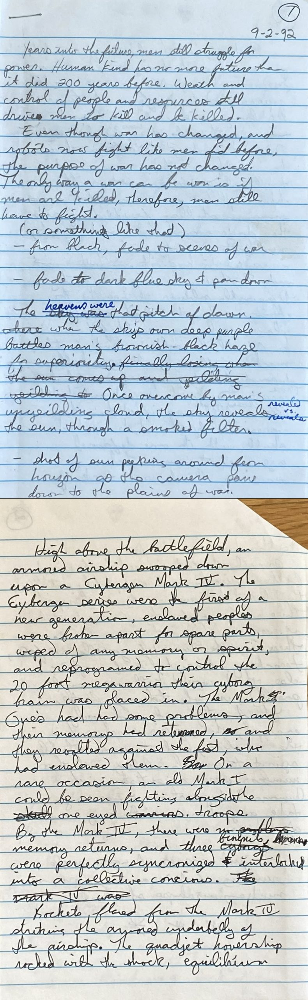

Warning: Spoilers if you read the text in the IMAGE. NO Spoilers in this post otherwise.

I’m currently going through old paperwork that’s been stored in the basement for the last 10 years, attempting to get rid of enough stuff so that I can convert a miniscule downstairs room into an even more Lilliputian “hang out room”, as my kids are wont to call it. I mean, who needs an entire box full of University Newspapers from the 1990s? Not me, that’s for sure. Not sure why they were collected anyway…

{.small}

So, what is this? It’s the origin of the primary storyline of The Fall, which has been hinted at in Vanir and flash-forwarded to in The Arc. This is the real stuff here! It’s the story of how everything fell apart after the final event in The Arc (no spoilers here, unless you zoom in and read the text). It’s the (now) Eric storyline, and introduces the great power competition between the two factions introduced in The Fall and alluded to in Vanir.

Why am I posting it? Look at the date on the first page, upper right corner. September 2, 1992. I was nineteen then! This world has been brewing for a long time. Eventually, this made its way to a Word file (there are actually about 20 pages like this), from which I cut/pasted a small part for Vanir, and which you’ll see much, much more of in The Fall.

What’s my point? Don’t wait to follow your dreams. Get to them now. Although I’m a much different person than I was back then, and my books benefit from my longer life-experience, I could have had many books published already (or at least waiting for self-/vanity-publishing platforms).